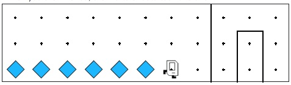

# Karel Beeper Path Follow

## Problem Statement

Karel was trying to get back home but got lost! Luckily, they set a path of beepers down as they were traveling earlier. Write a program that makes Karel follow and travel past the end of a straight line of beepers so they can make it home!

## Solution Link

[Click here to view the solution in the Code in Place editor](https://codeinplace.stanford.edu/cip5/share/mRqjNPAKVWzgTOFDEJk8)

