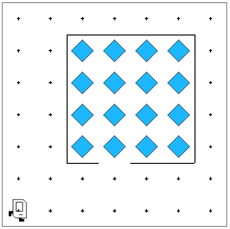

# Karel Puzzle Completion Task

## Problem Statement

Your task: Karel has picked up a new hobby: doing puzzles! Karel is trying to complete this puzzle made up of beepers. When complete, the puzzle should look like this:

## Solution Link

[Click here to view the solution in the Code in Place editor](https://codeinplace.stanford.edu/cip5/share/kinOHdGhQ2ap0JmF98Yv)
