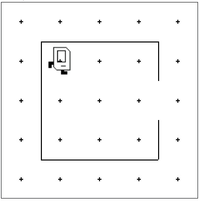

# Karel Beeper Pick-Up and Return Task

## Problem Statement

Your task is to write a program in `main.py` that makes **Karel** perform the following actions:

- Pick up a beeper.
- Return back into her house.

You can solve this using the Karel programming environment provided in Stanford's Code in Place course.

## Solution Link

[Click here to view the solution in the Code in Place editor](https://codeinplace.stanford.edu/cip5/share/SuK0AfNeEUbc9WITy6OR)
