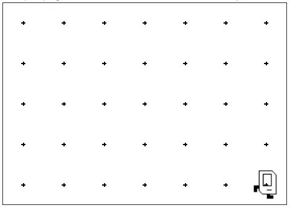

# Karel Beeper Pick-Up Task

## Problem Statement

Your task is to write a program in the editor that makes **Karel** pick up all the beepers on the first row of this world.

You can solve this using the Karel programming environment provided in Stanford's Code in Place course.

## Solution Link

[Click here to view the solution in the Code in Place editor](https://codeinplace.stanford.edu/cip5/share/Me6HXIGLPzbqLUt1J1ik)

