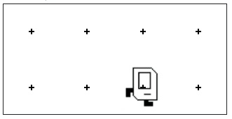

# Karel Beeper Pick-Up Task

## Problem Statement

Your task is to write a program that makes **Karel** perform the following actions:

1. Move forward one step.
2. Pick up a beeper.
3. Move forward one more step.

## Explanation

The given program is designed to control Karel, a robot in a simple programming environment, to perform a series of actions. Here's how it works:

1. **Imports the Karel library**:
  
2. **The main function**:

   * `move()`: Moves Karel one step forward.
   * `pick_beeper()`: Makes Karel pick up a beeper from the current location.
   * `move()`: Karel moves one step forward again.

### Solution

The program performs exactly what is required:

1. Move Karel one step forward.
2. Pick up the beeper.
3. Move Karel one more step forward.

### How the program works:

1. Karel moves forward by one step.
2. Karel picks up a beeper from the current position.
3. Karel moves forward another step.

This fulfills the task requirements.

## Solution Link

[Click here to view the solution in the Code in Place editor](https://codeinplace.stanford.edu/cip5/share/V1GlcDzWliSTKrn2Rau2)

