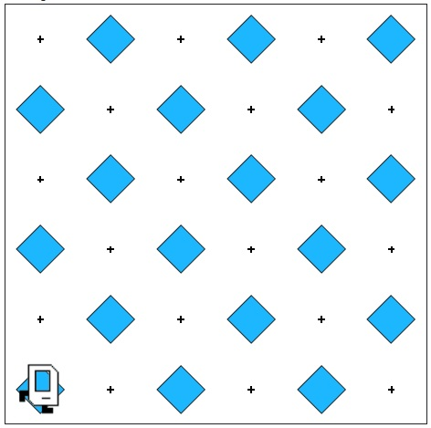

# Karel Checkerboard Pattern Task

## Problem Statement

Your task is to write a program that gets Karel to create a checkerboard pattern of beepers inside an empty rectangular world, as illustrated in the image below:

You can solve this using the Karel programming environment provided in Stanford's Code in Place course.

## Solution Link

[Click here to view the solution in the Code in Place editor](https://codeinplace.stanford.edu/cip5/share/tWg0PLCOTQN8NqOWGfuC)

