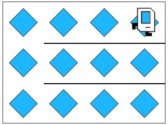

## Karel Beeper Filling Task

## Problem Statement

Your task is to help Karel fill the world with beepers, regardless of its size. Karel should move through the world, placing beepers at each location.

You can solve this using the Karel programming environment provided in Stanford's Code in Place course.

## Solution Link

[Click here to view the solution in the Code in Place editor](https://codeinplace.stanford.edu/cip5/share/k49LXdOJWYXiEV2EbCpx)

