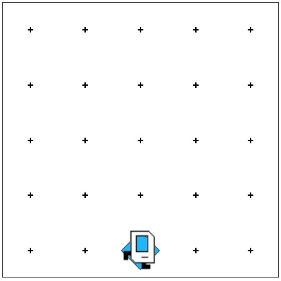

# Karel Midpoint of 1st Street

## Problem Statement

Your task: As an exercise in solving algorithmic problems, you will program to find the midpoint of 1st Street. Say Karel starts in the 5x5 world. Karel should end in the center of 1st row facing East.

You can solve this using the Karel programming environment provided in Stanford's Code in Place course.

## Solution Link

[Click here to view the solution in the Code in Place editor](https://codeinplace.stanford.edu/cip5/share/f7ce38tHfjC5AKRLwHLT)

