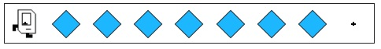

# Karel Beeper Spreading Task

## Problem Statement

Your task: In this task, Karel starts by standing in front of a pile of beepers that Karel needs to spread out along the row.  
Below is an example of the expected result:

You can solve this using the Karel programming environment provided in Stanford's Code in Place course.

## Solution Link

[Click here to view the solution in the Code in Place editor](https://codeinplace.stanford.edu/cip5/share/IfdS4CUsy2LEtcGu4SYc)

