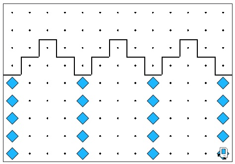

# Karel Temple of Artemis - Column Building

## Problem Statement

Your task: Karel has been hired to build the columns in the Temple of Artemis in Efes. In particular, there are a set of arches where the stones (represented by beepers, of course) are missing from the columns supporting the arches. Karel needs to place the missing stones in the correct spots.

You can solve this using the Karel programming environment provided in Stanford's Code in Place course.

## Solution Link

[Click here to view the solution in the Code in Place editor](https://codeinplace.stanford.edu/cip5/share/GQ1Vj8hszHorgglzztni)

