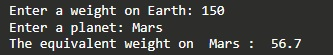

# Python Program for Weight Calculation on Different Planets

## Problem Statement

Write a **Python program** that prompts an Earthling to enter their weight on Earth and the planet they want to calculate their weight on. Then, print their calculated weight on the selected planet.

The program should support the following planets:
- Mars (37.8%)
- Jupiter (236%)
- Venus (88.9%)
- Mercury (37.6%)
- Saturn (108.1%)
- Uranus (81.5%)
- Neptune (114%)

You can solve this using the Python programming environment provided in Stanford's Code in Place course.

## Solution Link

[Click here to view the solution in the Code in Place editor](https://codeinplace.stanford.edu/cip5/share/VHNUEOve3G8vD2GStBNB)
