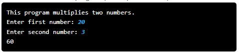

# Python Multiplication Program

## Problem Statement

Your task: Write a Python program that takes two integer inputs from the user and calculates the value of the first number multiplied with the second. The program should perform the following tasks:

After printing "This program multiplies two numbers."

1. Prompt the user to enter the first number.  
2. Read the input and convert it to an integer.  
3. Prompt the user to enter the second number.  
4. Read the input and convert it to an integer.  
5. Calculate the value of multiplying the two numbers.  
6. Print the value.

You can solve this using the Python programming environment provided in Stanford's Code in Place course.

## Solution Link

[Click here to view the solution in the Code in Place editor](https://codeinplace.stanford.edu/cip5/share/vOqm2Du17KIZkErkEbrl)
