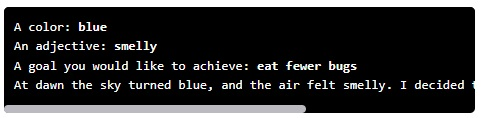

# Karel Fill in the Blank Story

## Problem Statement

Your task: Write a **Fill in the Blank** program similar to the one in the *Print Input Lesson*. Your program should request three strings from the user:

- a **color**  
- an **adjective**  
- a **goal you would like to achieve**  

Once the inputs are gathered, the story should fill in the following template:

> At dawn the sky turned [color], and the air felt [adjective]. I decided today I will finally [goal].

Make sure the output matches the formatting shown in the sample.

You can solve this using the Python programming environment provided in Stanford's Code in Place course.

## Solution Link

[Click here to view the solution in the Code in Place editor](https://codeinplace.stanford.edu/cip5/share/LpIoIWASkVfWlNL6BUqO)
