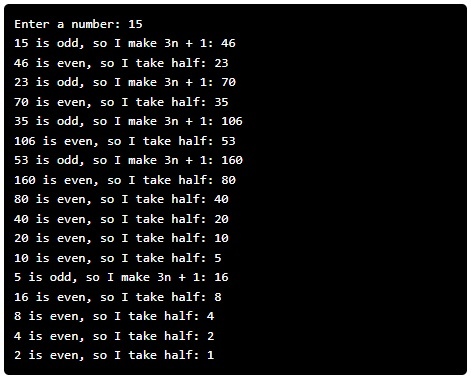

---

# Hofstadter's Sequence

## Problem Statement

Douglas Hofstadter’s Pulitzer-prize-winning book *Gödel, Escher, Bach* contains many intriguing mathematical puzzles, including this one from Chapter XII:

1. Pick a positive integer `n`.
2. If `n` is even, divide it by 2.
3. If `n` is odd, multiply it by 3 and add 1.
4. Repeat this process until `n` becomes 1.

Your task is to write a program that performs this sequence for any starting number and prints each value of `n` along the way.

You can solve this using the python programming environment provided in Stanford's *Code in Place* course.

## Solution Link

[Click here to view the solution in the Code in Place editor](https://codeinplace.stanford.edu/cip5/share/rO3jAcJ5QWNjbK2AtB0m)

---

