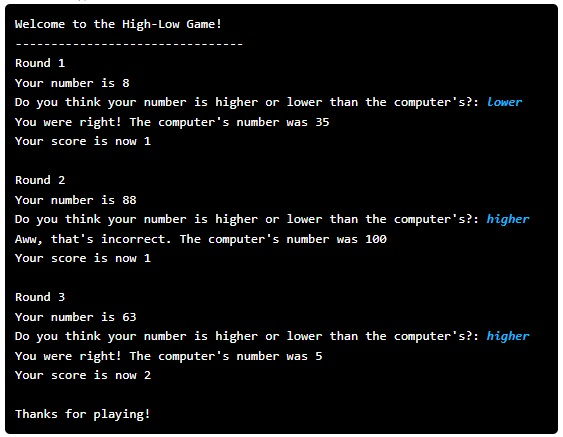

# High-Low Game

## Problem Statement

We want you to gain more experience working with control flow and Booleans in Python. To do this, we are going to have you develop a game! The game is called **High-Low** and the way it's played goes as follows:

- Two numbers are generated from 1 to 100 (inclusive on both ends): one for you and one for a computer, who will be your opponent.  
- You get to see your number, but not the computer's!  
- You make a guess, saying your number is either higher than or lower than the computer's number.  
- If your guess matches the truth (e.g. you guess your number is higher, and your number is actually higher than the computer's), you get a point!

These steps make up one round of the game.  
The game is over after all rounds have been played.

You can solve this using the python programming environment provided in Stanford's Code in Place course.

## Solution Link

[Click here to view the solution in the Code in Place editor](https://codeinplace.stanford.edu/cip5/share/vqng38kwWnwf369VsKvM)
