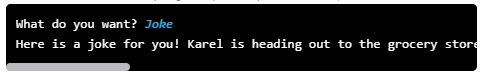

---

# Joke Bot

## Problem Statement

Write a simple joke bot. The bot starts by asking the user what they want. However, your program will only respond to one response: `Joke`.

If the user types `Joke`, your bot should respond with a funny line. For any other response, the bot should say something like "Sorry, I only tell jokes."

You can solve this using the Karel programming environment provided in Stanford's *Code in Place* course.

## Solution Link

[Click here to view the solution in the Code in Place editor](https://codeinplace.stanford.edu/cip5/share/JpRnemaql9rq0EXySnqZ)

---
