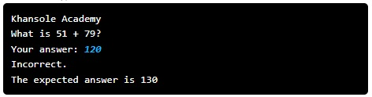

---

# Khansole Academy

## Problem Statement

In **Code in Place**, we are all about building technology to help folks learn. Now it is your turn.

Implement **Khansole Academy** — a program that helps other people learn addition!

Write a program that randomly generates a simple addition problem for the user, reads in the answer from the user, and then checks to see if they got it right or wrong.

- The program should generate two random **2-digit integers** (i.e., values between **10 and 99**).
- It should then **display the addition problem** to the user.
- The user inputs their answer.
- The program **compares** the user's answer with the correct result.
- It prints whether the user is **correct or incorrect**, and shows the right answer if they got it wrong.

You can solve this using the python programming environment provided in Stanford's *Code in Place* course.

## Solution Link

[Click here to view the solution in the Code in Place editor](https://codeinplace.stanford.edu/cip5/share/vhH3FAD3oaS9rLoHBxn1)

---
