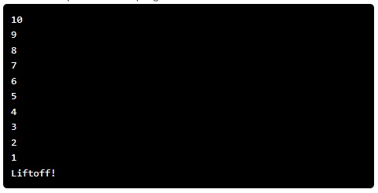

---

# Spaceship Launch Countdown

## Problem Statement

Write a program that prints out the calls for a spaceship that is about to launch.  
Countdown from `10` to `1` and then output:

```

Liftoff!

```


You can solve this using the python programming environment provided in Stanford's *Code in Place* course.

## Solution Link

[Click here to view the solution in the Code in Place editor](https://codeinplace.stanford.edu/cip5/share/g6QzD6VCbcFNxZMYwvkl)

---
