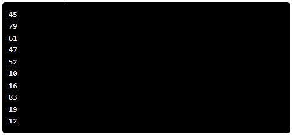

---

# Print 10 Random Numbers

## Problem Statement

Write a program that generates and prints 10 random numbers in the range of 1 to 100. Once you're done, click on the "Check Correct" button.

You can solve this using the Karel programming environment provided in Stanford's *Code in Place* course.

## Solution Link

[Click here to view the solution in the Code in Place editor](https://codeinplace.stanford.edu/cip5/share/lEmU0Y0fs6wM50XWncc1)

---
