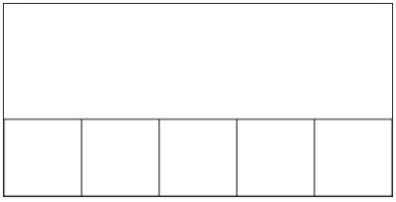

---

# Line of Boxes

## Problem Statement

Make a line of boxes as shown below, such that the boxes fill the bottom of the canvas. Each box should have a width and height of `BOX_SIZE`, making a total of 5 boxes perfectly in line with one another along the bottom of the canvas.

You can solve this using the python programming environment provided in Stanford's *Code in Place* course.

## Solution Link

[Click here to view the solution in the Code in Place editor](https://codeinplace.stanford.edu/cip5/share/4woEdzdCS9VMW769Tgv5)

---

