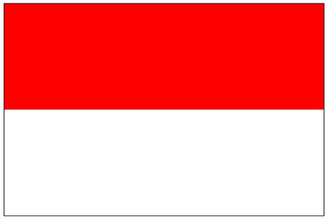

# Draw the Flag of Indonesia

## Problem Statement

Students in Code in Place are from 150 different countries! Wow. Let's celebrate our international class by drawing flags.  
To start out, one of the most straightforward flags to draw using Python graphics is the flag of **Indonesia**.

Use Python's graphics library to draw a simple rectangular flag with two horizontal halves — red on the top and white on the bottom.

You can solve this using the python programming environment provided in Stanford's *Code in Place* course.

## Solution Link

[Click here to view the solution in the Code in Place editor](https://codeinplace.stanford.edu/cip5/share/6MssgzVboWAYhf2bLp4c)

