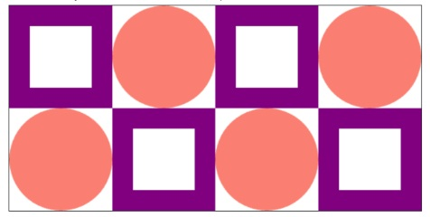

---

# Quilt Patch Generator

## Problem Statement

A quilt, as you may know, is a blanket often composed of repeating "patches". In this problem, your task is to create a simple digital quilt by drawing repeating patterns using code. The goal is to understand how loops and drawing operations can generate beautiful, structured visuals, similar to a real-world quilt.

Each patch will follow a predefined design, and multiple patches will be arranged in a grid-like fashion to simulate a complete quilt. This is a great exercise in working with nested loops and graphical elements.

You can solve this using the python programming environment provided in Stanford's *Code in Place* course.

## 🔗 Solution Link

[Click here to view the solution in the Code in Place editor](https://codeinplace.stanford.edu/cip5/share/xiATXGo2VaO52V8Cg6BG)

---