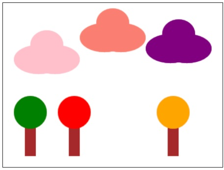

---

# 🌲 Nature Scene Builder

## Problem Statement

Build the nature scene shown in the image below. This assignment will not be graded (you can click "Mark Complete" to mark it as done), so don't worry too much about recreating it exactly. The goal is for you to get experience writing functions which take parameters.

You can solve this using the python programming environment provided in Stanford's *Code in Place* course.

## Solution Link

[Click here to view the solution in the Code in Place editor](https://codeinplace.stanford.edu/cip5/share/NOe5aGbpZF9HxuDB6Q61)

---

